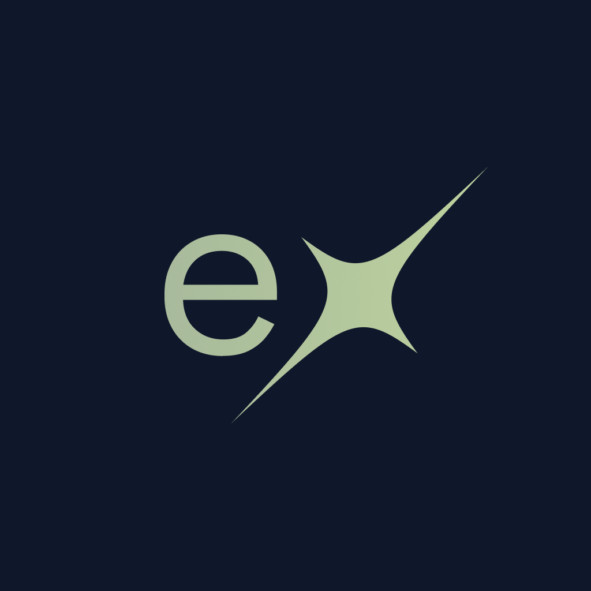
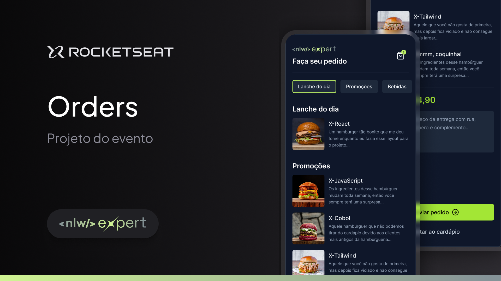

<p align="center">
  
</p>

<p align="center">
  <a href="LICENSE">
  </a>
</p>

<p align="center">
  
</p>

<p align="center">
  <a href="#-layout">Layout</a> •
  <a href="#-tecnologies">Tecnologias</a> •
  <a href="#-start">Start</a> •
  <a href="#-license">Licença</a>
</p>

## Layout

You can view the project layout through the link below:

<!-- TODO: Fix link -->

- [Nlw Experts - Figma](https://www.figma.com/community/file/1336456468568916765/nlw-expert-orders)

Remembering that you need to have a [Figma](http://figma.com) account to access it.

## Tecnologias

- [React Native](https://reactnative.dev/)
- [TypeScript](https://www.typescriptlang.org/)
- [Expo](https://expo.dev/)
- [NativeWind](https://www.nativewind.dev/)

## Start

### Requirements

- [Node.js](https://nodejs.org/en/)
- [Npm](https://www.npmjs.com/)
- [Android Studio](https://nodejs.org/en/)

**Clone the project and access the folder**

```bash
git clone https://github.com/markus90souza/mobile-nlwexperts.git && cd mobile-nlwexperts
```

**Follow the steps below**

```bash
# Instale as dependencias do projeto
$ npm install
# Inicie o app no Expo GO
$ npx expo dev --clear

```

## 📝 License

This project is licensed under the MIT License - see the [LICENSE](LICENSE) file for details.

---

<p align="center">
  Made with 💜 by <a href="https://www.linkedin.com/in/eliasgcf/">Marcos de Souza</a>
</p>
